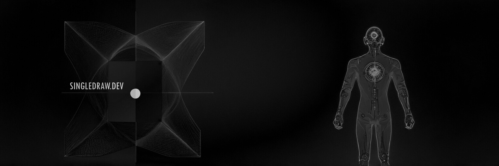

   

  
<h2>Hi there! I'm Kamil 👋</h2>

**Multifaceted Developer | Tech Enthusiast**

- **Current Role:** Fullstack developer at a woven wire meshes production company / quarry and mining industry.
- **Skills:** Full-stack development (mainly Next.js, Laravel & MySQL, Node.js), 3D rendering & animation (Three.js / react-three-fiber), WebAssembly (EMSCripten), Automation (Ansible, Bash), CAD modeling (SolidWorks), physics engines (Ammo, Babylon), design (rasters, vectors, publishing, UI), content creation.
- **Projects:** For last several years i was focused on inventing, designing and developing services for the production company I work for such as very granular and detailed procedural 3d product configurator dedicated to our customers and employees, automation of some office and production tasks such as creating documents, material & time cost calculations, production drawings generated directly from placed orders, b2b platfrom for managing orders and quotations, discount and pricing strategies implementations. Responsible for the entire lifecycle from data gathering through interviews with production line workers and management, selection of architecture and technology to development & final deployment.
- **Focus Areas:** 
  - 3D rendering and performance optimization
  - Software architecture
  - GLSL and advanced rendering algorithms
  - Automation
- **Current Technologies:** <b>TypeScript/JavaScript (Next.js/React/Node.js/Three.js/R3F/Vanilla), PHP (Laravel), WebAssembly(Emscripten), MySQL, Bash, Docker, Ansible</b>
- **Continuous Learning:** Always exploring new technologies and techniques to enhance my skill set, currently diving into Orchestration with MicroK8s and Swarm and db clusters.
- **Collaborations:** Open to discussing 3D rendering, performance optimization, tasks automation.
- **Fun Fact:** When I'm not coding or reading, I enjoy creating things made out of wood, playing blues on piano and guitar, and taking care of my beloved rat family.
- **Contact:** Feel free to reach out via [email](mailto:truckdriverbuck@gmail.com).

<!--
**SingleDraw/SingleDraw** is a ✨ _special_ ✨ repository because its `README.md` (this file) appears on your GitHub profile.

Here are some ideas to get you started:

- 🔭 I’m currently working on ...
- 🌱 I’m currently learning ...
- 👯 I’m looking to collaborate on ...
- 🤔 I’m looking for help with ...
- 💬 Ask me about ...
- 📫 How to reach me: ...
- 😄 Pronouns: ...
- ⚡ Fun fact: ...
-->
