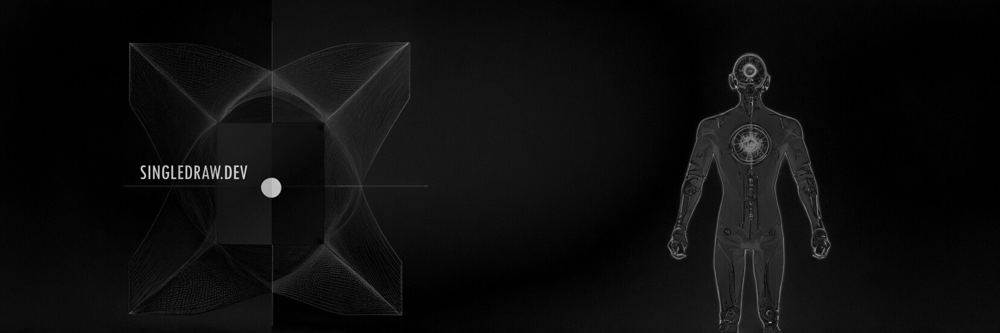

   

  
<h2>Hi there! I'm Kamil 👋</h2>

**Fullstack | Tech Enthusiast**

- **Current Role:** Fullstack dev at a woven wire meshes production company / quarry and mining industry.
- **Skills:** Typescript (Next, Node, React, Nest), strong 3D rendering & animation exp (Three.js / react-three-fiber), WebAssembly (EMSCripten), Automation (Ansible, Bash Python), CAD modeling (SolidWorks), physics engines (Ammo, Babylon), design (rasters, vectors, publishing, UI).
- **Projects:** For last several years i was focused on developing solutions / services for our production company, b2b area. Responsible for the entire lifecycle from data gathering through interviews with production line workers and management, selection of architecture and technology to development & final deployment.
- **Focus Areas:** 
  - 3D rendering and performance optimization
  - Big Data / ML
  - GLSL and advanced rendering algorithms
  - Automation
- **Current Technologies:** <b>TypeScript/JavaScript (Next.js/React/Node.js/Three.js/R3F/Vanilla), PHP (Laravel), WebAssembly(Emscripten), MySQL, Bash, Docker, Ansible</b>
- **Continuous Learning:** Always exploring new technologies and techniques to enhance my skill set, currently diving into Big Data Stacks and Cloud services.
- **Collaborations:** Open to discussing 3D rendering, performance optimization, automation.
- **Fun Fact:** Rat lover.
- **Contact:** Feel free to reach out via [email](mailto:truckdriverbuck@gmail.com).

<!--
**SingleDraw/SingleDraw** is a ✨ _special_ ✨ repository because its `README.md` (this file) appears on your GitHub profile.

Here are some ideas to get you started:

- 🔭 I’m currently working on ...
- 🌱 I’m currently learning ...
- 👯 I’m looking to collaborate on ...
- 🤔 I’m looking for help with ...
- 💬 Ask me about ...
- 📫 How to reach me: ...
- 😄 Pronouns: ...
- ⚡ Fun fact: ...
-->
